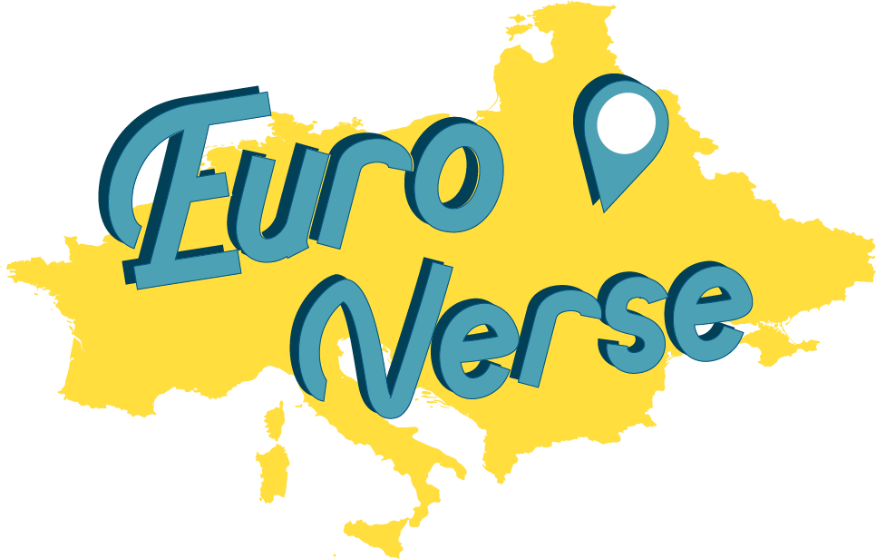

# Euroverse
유로버스 : 여행정보 및 플래너 제공 사이트 
> 여행의 시작인 항공권 및 숙소 결제부터 플래너 작성, 예산 점검, 동행찾기, 실시간 채팅, 그리고 커뮤니티를 통한 유저간의 소통까지 제공하는 유럽여행 종합 플랫폼 '[Euroverse](http://15.165.86.252:8080/)'

- 개발 기간 : 2020.01.01 ~ 2020.03.11 (총 2개월)
  - 분석 및 설계 : 2020.01.01 ~ 2020.01.24 
  - 구현 : 2020.01.27 ~ 2020.03.07
- 참여 인원 : 6명
- Model 2 MVC Web Architecture Pattern

## 기술 스택
- Front-end : Javascript, HTML5/CSS3, JSP, BootStrap, JQuery, Ajax
- Back-end : Java, Spring Framework 4.0.9, MyBatis, Apache Tomcat
- Database : Oracle 10g, MongoDB 3.6.17
- 버전 관리 : Github
- Tool : Eclipse, VSCode, DBeaver, SqlDeveloper 
- 라이브러리 : JDBC, DBCP, JUnit4, Log4jdbc, AspectJ, Jackson, JSON-Simple, SweetAlert, CKEditor4, Foreign exchange rates API, 공공데이터포털API, 청기와 LAB, I'mPort API, JavaMail API, FullCalendar, Selenium, SummerNote, 네이버로그인 API, 카카오로그인 API, GoogleMap API, Owl Carousel, AOS, Swiper API

## 프로젝트 내용 
- 기능 (모듈별)
  1. 플래너 작성
  2. 커뮤니티 
  3. 동행 구하기 & 채팅
  4. 항공권 및 숙소 검색/구매
  5. 여행정보...

## 추가
- 아마존 웹 서비스(AWS) EC2 배포를 통해 웹 서버 구축 방법 이해

## 참고
- 항공권 및 숙소 검색기능 빠개짐...... (Selenium AWS에 이식 실패)
- [프로젝트 발표](https://www.youtube.com/watch?v=xGH5Dzj8rAY)

